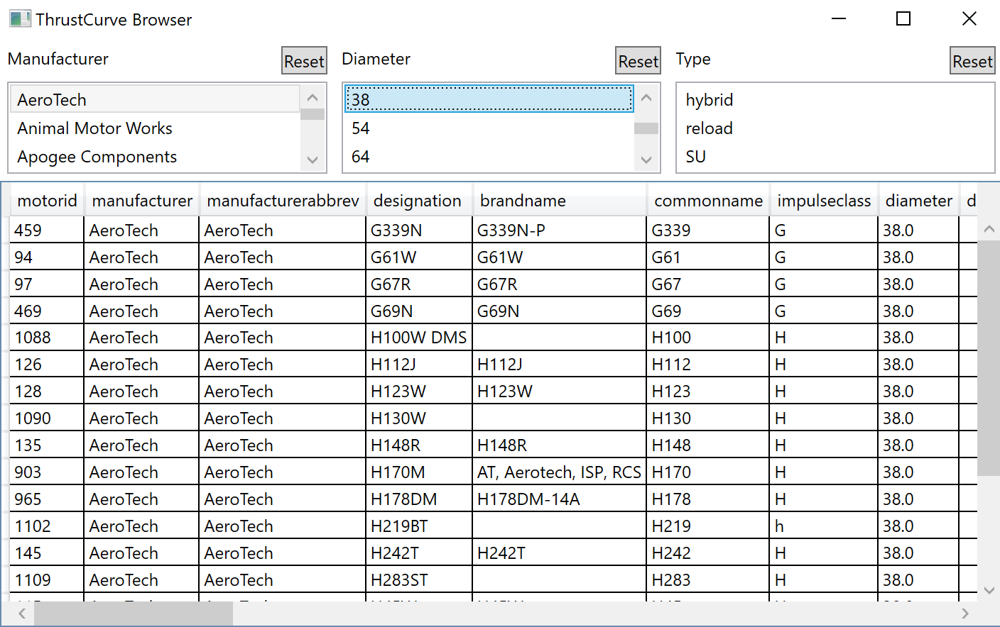

# ThrustCurve Browser

This is a hobby project I did in December 2018 to learn C#/XAML. The app
queries against a public database of hobby rocket engines 
[(ThrustCurve)](http://thrustcurve.org/). This site offers an XML API, intended
for desktop simulation apps like OpenRocket and RockSim.

The models were generated using `xsd.exe` using XML schema files provided by
ThrustCurve, and are tracked in the `Interfaces` folder. The source schema
files are in `Schema`.